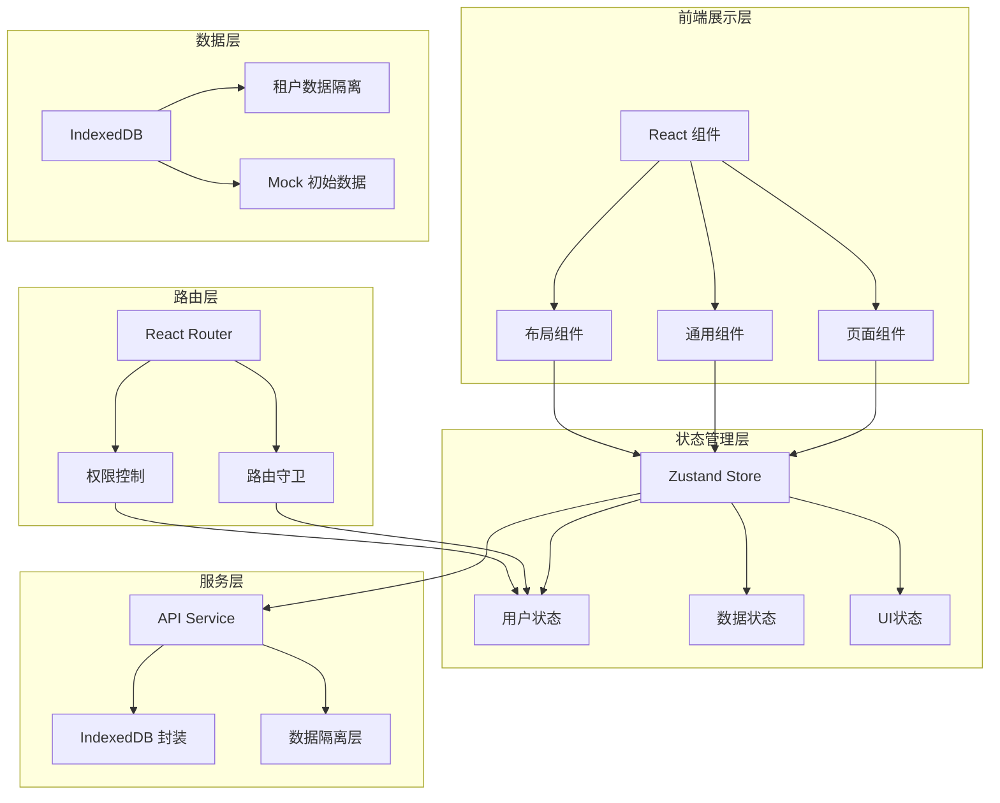
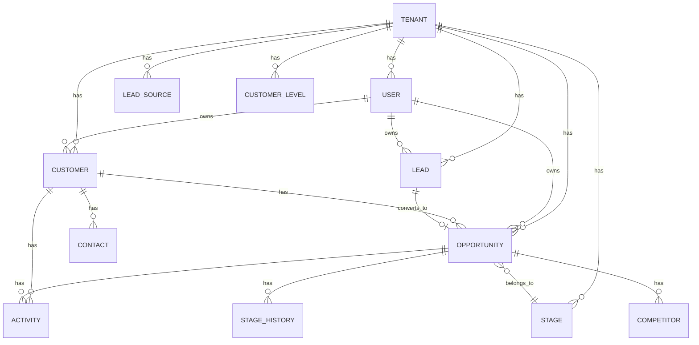

## 1. 架构设计



## 2. 技术选型

- **前端框架**：React 18 + TypeScript
- **构建工具**：Vite 5
- **样式方案**：TailwindCSS 3
- **状态管理**：Zustand
- **路由**：React Router v6
- **图表库**：Recharts（趋势图、漏斗图）
- **图标库**：Lucide React
- **本地存储**：IndexedDB (idb 库)
- **UI组件**：自定义组件 + Radix UI 原语
- **拖拽**：@dnd-kit/core（看板拖拽）

## 3. 目录结构

```
src/
├── components/          # 通用组件
│   ├── ui/             # 基础UI组件（Button, Input, Modal等）
│   ├── layout/         # 布局组件（Sidebar, Header等）
│   ├── charts/         # 图表组件
│   └── common/         # 业务通用组件
├── pages/              # 页面组件
│   ├── Dashboard/
│   ├── Customers/
│   ├── Leads/
│   ├── Opportunities/
│   ├── Funnel/
│   ├── Team/
│   ├── Settings/
│   └── Login/
├── stores/             # Zustand stores
│   ├── useAuthStore.ts
│   ├── useDataStore.ts
│   └── useUIZStore.ts
├── services/           # API/数据服务
│   ├── db.ts           # IndexedDB 封装
│   ├── auth.service.ts
│   ├── customer.service.ts
│   ├── lead.service.ts
│   └── opportunity.service.ts
├── hooks/              # 自定义Hooks
│   ├── usePermissions.ts
│   ├── useTenantData.ts
│   └── usePagination.ts
├── utils/              # 工具函数
│   ├── date.ts
│   ├── format.ts
│   └── permissions.ts
├── types/              # TypeScript 类型定义
│   ├── index.ts
│   └── models.ts
├── data/               # Mock 数据
│   └── seed.ts
├── router/             # 路由配置
│   └── index.tsx
├── App.tsx
└── main.tsx
```

## 4. 路由定义

| 路由路径 | 页面名称 | 权限要求 |
|----------|----------|----------|
| `/login` | 登录页 | 公开 |
| `/` | 仪表盘 | 登录用户 |
| `/customers` | 客户列表 | 登录用户 |
| `/customers/:id` | 客户详情 | 登录用户 |
| `/leads` | 线索池 | 登录用户 |
| `/leads/:id` | 线索详情 | 登录用户 |
| `/opportunities` | 商机管理 | 登录用户 |
| `/opportunities/:id` | 商机详情 | 登录用户 |
| `/funnel` | 销售漏斗 | 登录用户 |
| `/team` | 团队成员 | 租户管理员/销售经理 |
| `/settings` | 系统设置 | 租户管理员 |

## 5. 数据模型

### 5.1 实体关系图



### 5.2 核心数据结构

```typescript
// 租户
interface Tenant {
  id: string;
  name: string;
  logo?: string;
  industry: string;
  timezone: string;
  createdAt: string;
}

// 用户
interface User {
  id: string;
  tenantId: string;
  name: string;
  email: string;
  phone?: string;
  avatar?: string;
  role: 'super_admin' | 'tenant_admin' | 'sales_manager' | 'sales_rep';
  status: 'active' | 'disabled';
  createdAt: string;
}

// 客户
interface Customer {
  id: string;
  tenantId: string;
  ownerId: string;
  name: string;
  industry: string;
  level: 'A' | 'B' | 'C' | 'D';
  address?: string;
  website?: string;
  notes?: string;
  lastFollowUpAt?: string;
  createdAt: string;
  updatedAt: string;
}

// 联系人
interface Contact {
  id: string;
  customerId: string;
  tenantId: string;
  name: string;
  position?: string;
  phone?: string;
  email?: string;
  isDecisionMaker: boolean;
  createdAt: string;
}

// 线索
interface Lead {
  id: string;
  tenantId: string;
  ownerId?: string;
  sourceId: string;
  companyName: string;
  contactName: string;
  phone?: string;
  email?: string;
  requirements?: string;
  notes?: string;
  status: 'new' | 'contacted' | 'converted' | 'discarded';
  discardReason?: string;
  createdAt: string;
  updatedAt: string;
}

// 商机
interface Opportunity {
  id: string;
  tenantId: string;
  customerId: string;
  ownerId: string;
  leadId?: string;
  name: string;
  stageId: string;
  amount: number;
  expectedCloseDate: string;
  probability: number;
  notes?: string;
  createdAt: string;
  updatedAt: string;
}

// 销售阶段
interface Stage {
  id: string;
  tenantId: string;
  name: string;
  color: string;
  order: number;
  isWin?: boolean;
  isLoss?: boolean;
  createdAt: string;
}

// 跟进记录
interface Activity {
  id: string;
  tenantId: string;
  customerId?: string;
  opportunityId?: string;
  userId: string;
  type: 'call' | 'visit' | 'email' | 'meeting' | 'other';
  content: string;
  createdAt: string;
}

// 阶段变更历史
interface StageHistory {
  id: string;
  opportunityId: string;
  tenantId: string;
  fromStageId?: string;
  toStageId: string;
  changedById: string;
  changedAt: string;
}

// 销售目标
interface SalesTarget {
  id: string;
  userId: string;
  tenantId: string;
  period: 'month' | 'quarter';
  periodValue: string;
  targetAmount: number;
  createdAt: string;
}

// 线索来源
interface LeadSource {
  id: string;
  tenantId: string;
  name: string;
  createdAt: string;
}

// 客户等级
interface CustomerLevel {
  id: string;
  tenantId: string;
  name: string;
  code: string;
  color: string;
  createdAt: string;
}
```

## 6. 多租户数据隔离方案

- **存储层**：IndexedDB 中所有数据表均包含 `tenantId` 字段
- **查询层**：所有数据查询自动注入 `tenantId` 过滤条件
- **切换租户**：切换租户时重新加载所有数据，清空当前状态
- **权限校验**：路由守卫检查用户是否属于当前租户

## 7. 权限控制方案

- **路由级**：React Router 路由守卫，无权限跳转 403
- **组件级**：`usePermissions` Hook + `PermissionGuard` 组件
- **操作级**：根据角色动态显示/隐藏操作按钮
- **数据级**：销售人员仅可见自己的数据，管理员可见全部

## 8. 性能优化

- 数据分页加载
- 列表虚拟滚动（大数据量时）
- React.memo 优化重渲染
- Zustand 状态选择器
- IndexedDB 索引优化
- 路由懒加载
